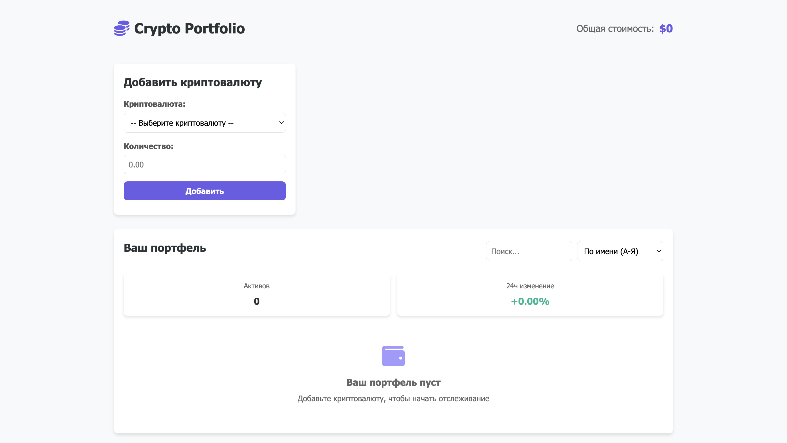
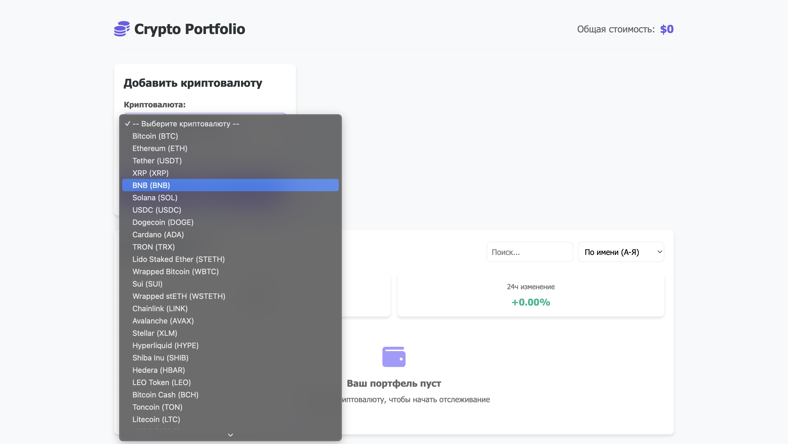
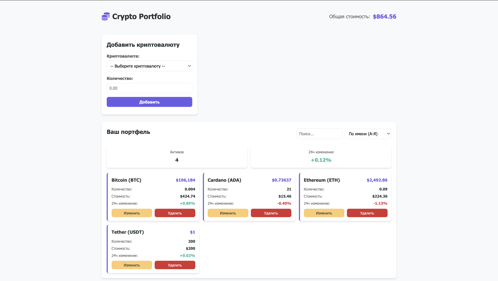

# Crypto Portfolio Tracker

## 1. Установка и запуск проекта

### Запуск приложения

1. Откройте файл `index.html` в браузере одним из способов:
   - Двойной клик по файлу
   - Через Live Server в VS Code
   - Через любой другой локальный сервер

## 2. Авторы проекта

- **Зуй Артём** - IA2403

## 3. Описание проекта

### Цель

Создание удобного инструмента для отслеживания криптовалютного портфеля с актуальными данными о курсах и автоматическими расчетами.

### Основные функции

- 📊 Отображение текущей стоимости портфеля
- ➕ Добавление новых криптоактивов
- 🔍 Фильтрация и сортировка активов
- 📈 Автоматическое обновление курсов
- 💾 Локальное сохранение данных

## 4. Примеры использования

### Добавление актива

```javascript
// Пример программного добавления
const newCrypto = {
  id: "bitcoin",
  symbol: "btc",
  name: "Bitcoin",
  amount: 0.5,
  price: 50000,
  change24h: 2.5,
};
portfolio.addAsset(newCrypto);
```

### Класс Portfolio (управление данными)

```javascript
// Добавление актива в портфель
addAsset(asset) {
  const existingAsset = this.assets.find(a => a.id === asset.id);

  if (existingAsset) {
    existingAsset.amount += parseFloat(asset.amount);
  } else {
    this.assets.push({
      id: asset.id,
      symbol: asset.symbol,
      name: asset.name,
      amount: parseFloat(asset.amount),
      price: asset.price || 0,
      change24h: asset.change24h || 0
    });
  }
  this.saveToLocalStorage();
}
```

### API взаимодействие

```javascript
// Получение списка криптовалют
async getCryptoList() {
  try {
    const response = await fetch(
      `${this.baseUrl}/coins/markets?vs_currency=usd&per_page=100`
    );
    return await response.json();
  } catch (error) {
    console.error('Ошибка загрузки:', error);
    return [];
  }
}
```

### Обработка формы добавления

```javascript
// В файле ui.js
handleAddFormSubmit = async (e) => {
  e.preventDefault();

  const cryptoId = this.cryptoSelect.value;
  const amount = this.cryptoAmount.value;

  if (!cryptoId || !amount) {
    this.showError("Заполните все поля");
    return;
  }

  const selectedCrypto = this.cryptoList.find((c) => c.id === cryptoId);
  const priceData = await this.api.getCryptoPrices(cryptoId);

  this.portfolio.addAsset({
    id: selectedCrypto.id,
    name: selectedCrypto.name,
    symbol: selectedCrypto.symbol,
    amount,
    price: priceData[0]?.current_price,
    change24h: priceData[0]?.price_change_percentage_24h,
  });

  this.updateUI();
};
```

### Фильтрация активов

```javascript
// Фильтрация по поисковому запросу
filterAssets(searchTerm) {
  return this.portfolio.assets.filter(asset =>
    asset.name.toLowerCase().includes(searchTerm.toLowerCase()) ||
    asset.symbol.toLowerCase().includes(searchTerm.toLowerCase())
  );
}
```

### Расчет статистики

```javascript
// Общая стоимость портфеля
getTotalValue() {
  return this.assets.reduce((total, asset) => {
    return total + (asset.price * asset.amount);
  }, 0).toFixed(2);
}

// Изменение за 24 часа (в процентах)
getDailyChange() {
  const totalValue = this.getTotalValue();
  if (totalValue === 0) return '0.00';

  const weightedChange = this.assets.reduce((sum, asset) => {
    const assetValue = asset.price * asset.amount;
    return sum + (assetValue / totalValue * (asset.change24h || 0));
  }, 0);

  return weightedChange.toFixed(2);
}
```

### Получение текущих цен

```javascript
const api = new API();
const prices = await api.getCryptoPrices("bitcoin,ethereum");
console.log(prices);
// Вывод: [{id: 'bitcoin', current_price: 50000, ...}, ...]
```

### Добавление тестовых данных

```javascript
const testPortfolio = new Portfolio();
testPortfolio.addAsset({
  id: "bitcoin",
  name: "Bitcoin",
  symbol: "btc",
  amount: 0.5,
  price: 50000,
  change24h: 2.5,
});

console.log(testPortfolio.getTotalValue());
// Вывод: 25000.00
```

### Скриншоты интерфейса

1. Главный экран с портфелем  
   
2. Форма добавления актива  
   
3. Тестовый портфель
   

## 5. Использованные источники

1. [CoinGecko API Documentation](https://www.coingecko.com/en/api)
2. [MDN Web Docs](https://developer.mozilla.org/)
3. [Font Awesome Icons](https://fontawesome.com/)

## 6. Дополнительная информация

### Технические особенности

- **Архитектура**: Модульная система (ES6 modules)
- **Хранение данных**: LocalStorage
- **Обновление данных**: Каждые 5 минут
- **API**: CoinGecko (топ-100 криптовалют)

### Ограничения

- Для работы требуется интернет-соединение
- Бесплатная версия API имеет ограничение 50 запросов/минуту
- Данные обновляются не в реальном времени, а с интервалом

### Советы по использованию

- Для точного расчета указывайте количество криптовалют с максимальной точностью
- Используйте фильтрацию при большом количестве активов
- Обновляйте страницу при проблемах с загрузкой данных
