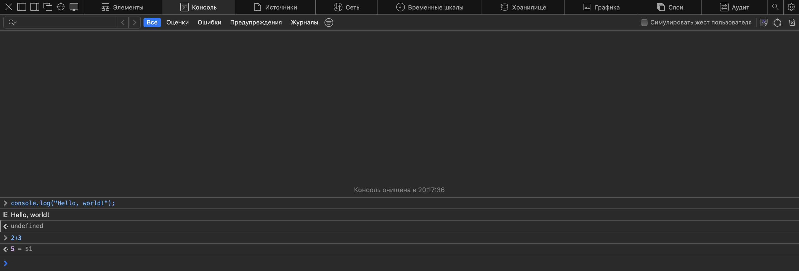
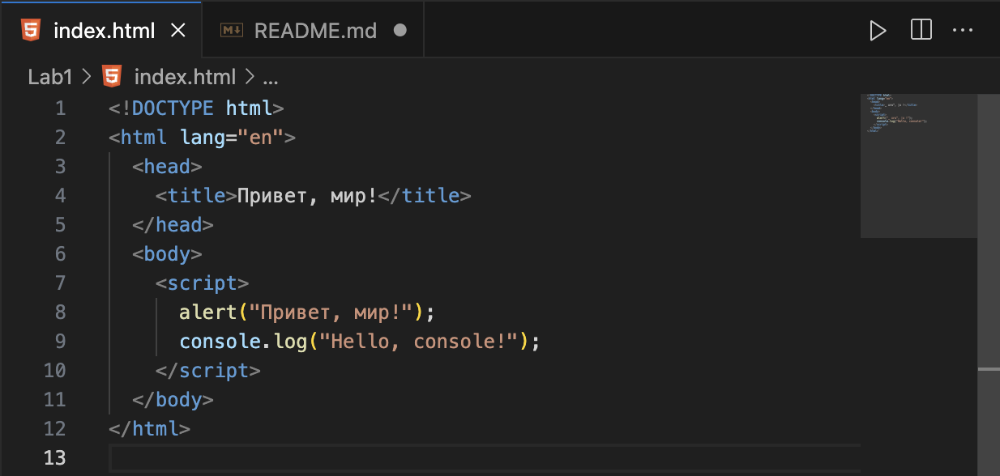
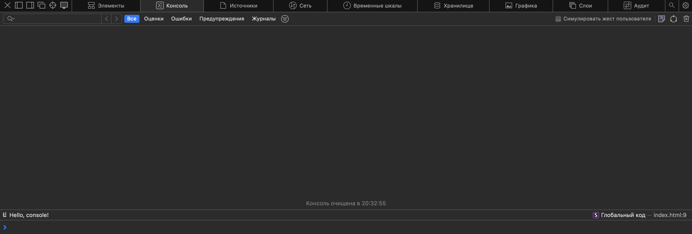
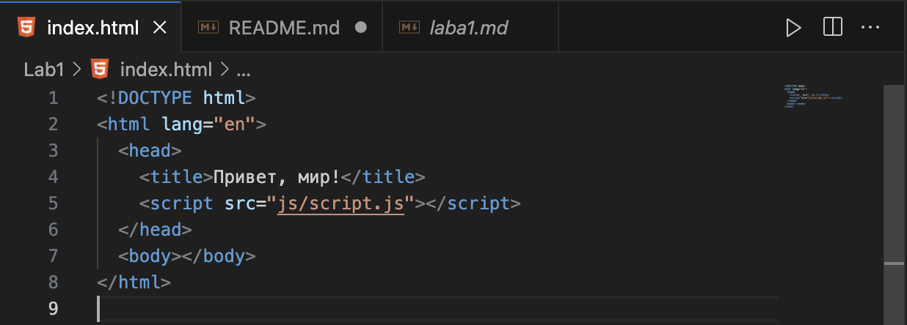
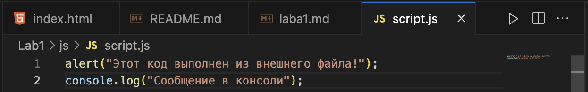
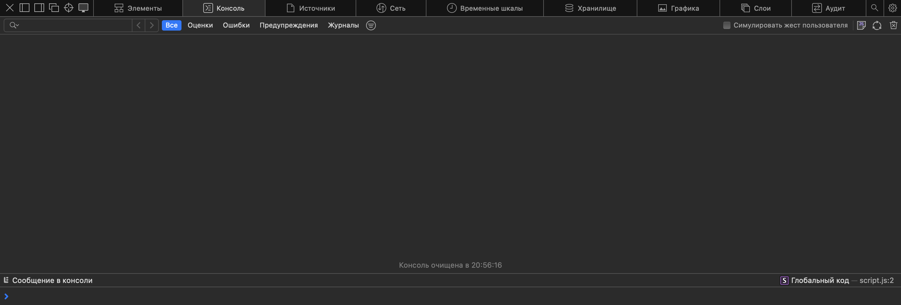
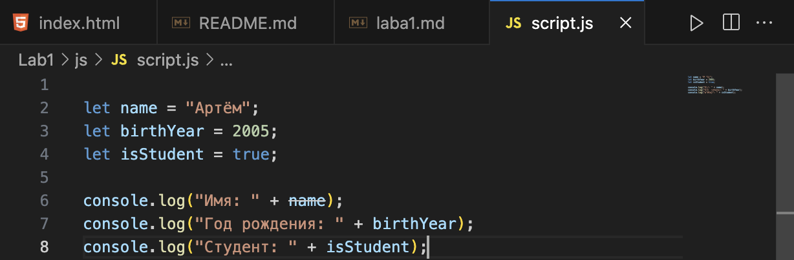
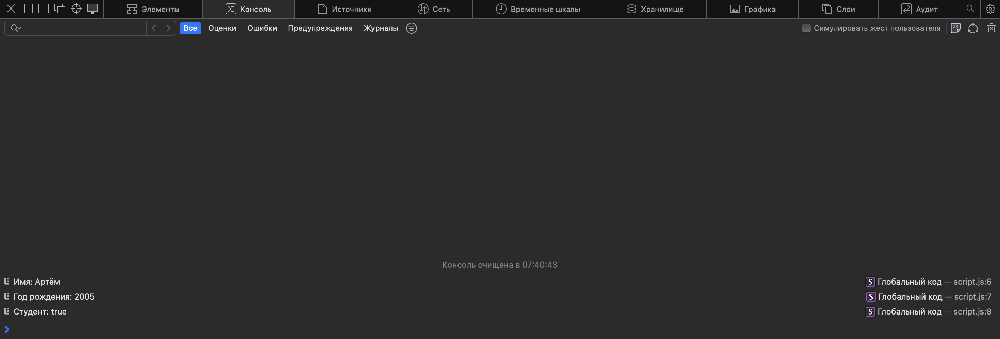
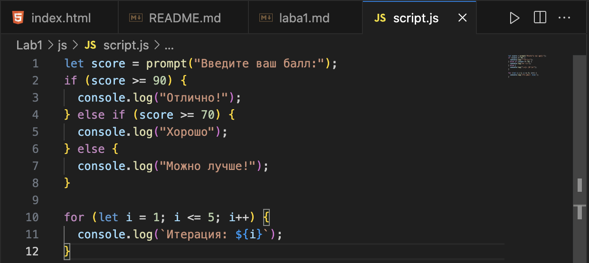
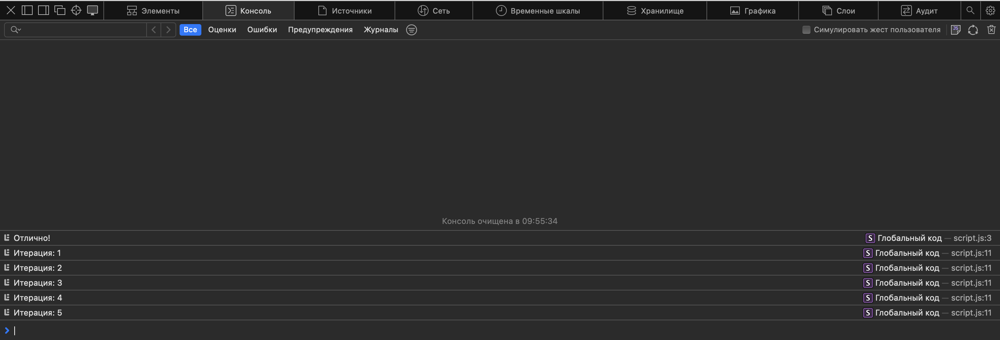

# Lab1

## Задание 1

1. #### Выполняем код JavaScript в браузерной консоли

   

2. #### Создание html файла со следующим содержанием:

   HTML
   
   Результат
   
   

3. #### Подключение внешнего JavaScript-файла.
   HTML
   
   JavaScript
   
   Результат
   
   

## Задание 2

1. #### Объявление переменных и работа с типами данных.

   JS
   
   Вывод
   

2. #### Управление потоком выполнения (условия и циклы).
   JS
   
   Результат
   
   

## Контрольные вопросы

1. `var` (устаревший способ объявления переменных):
   - Область видимости — функциональная (переменная доступна внутри всей функции, в которой объявлена).
   - Поддерживает всплытие (hoisting) — переменная создаётся в начале выполнения кода, но без значения (undefined).
   - Можно переобъявлять в одной области видимости.
   - Не ограничена блочной областью видимости, что может привести к ошибкам.

```javascript
function example() {
  console.log(a); // undefined (из-за всплытия)
  var a = 10;
  console.log(a); // 10
}
example();
```

2. `let` (современный способ объявления переменных):
   - Область видимости — блочная (переменная доступна только внутри {} блока, в котором объявлена).
   - Не всплывает так же, как var, но создаётся в "мёртвой зоне" (TDZ), пока не выполнится объявление.
   - Нельзя переобъявлять в одной области видимости, но можно изменять значение.

```javascript
function example() {
  console.log(b); // Ошибка! Обращение до объявления (TDZ)
  let b = 20;
  console.log(b); // 20
}
```

3. `const` (константа, неизменяемая переменная):
   - Область видимости — блочная, как у `let`.
   - Нельзя изменить значение после присвоения.
   - Нельзя переобъявлять в одной области видимости.
   - Если `const` содержит объект или массив, сам объект можно изменять, но нельзя переприсвоить саму переменную.

```javascript
const c = 30;
c = 40; // Ошибка! Нельзя изменить значение

const obj = { key: "value" };
obj.key = "new value"; // Работает (изменение свойства объекта)
obj = {}; // Ошибка! Переприсвоить объект нельзя
```

##

### Неявное преобразование типов:

```javascript
console.log("5" - 2); // 3 (строка "5" преобразуется в число)
console.log("5" + 2); // "52" (число 2 преобразуется в строку)
```

##

### Разница `==` и `===`:

- `==` сравнивает значения, выполняя преобразование типов.
- `===` сравнивает и значения, и типы без преобразования.

```javascript
console.log(5 == "5"); // true  (преобразование строки в число)
console.log(5 === "5"); // false (разные типы)
```
